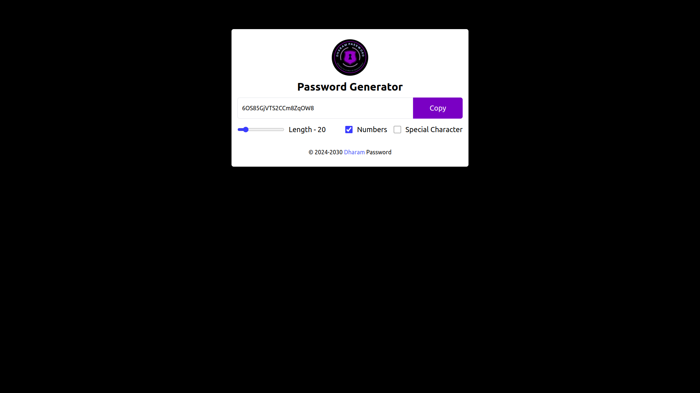

# Password Generator

This is a simple password generator application built with React.

## Description

This application generates random passwords based on user preferences like length, inclusion of numbers, and special characters. Users can customize the length of the password and choose whether to include numbers and special characters.

## Features

- Generate random passwords
- Customize password length
- Include numbers and special characters in passwords
- Copy generated password to clipboard

## Technologies Used

- React
- Tailwind CSS

## Preview

## How to Run

1. Clone this repository.
2. Navigate to the project directory.
3. Run `npm install` to install dependencies.
4. Run `npm run dev` to start the development server.
5. Open [http://localhost:5173](http://localhost:5173) to view it in the browser.

## Author

[Dharam IN](https://github.com/Dharam-IN)

## License

This project is licensed under the MIT License - see the [LICENSE](LICENSE) file for details.
